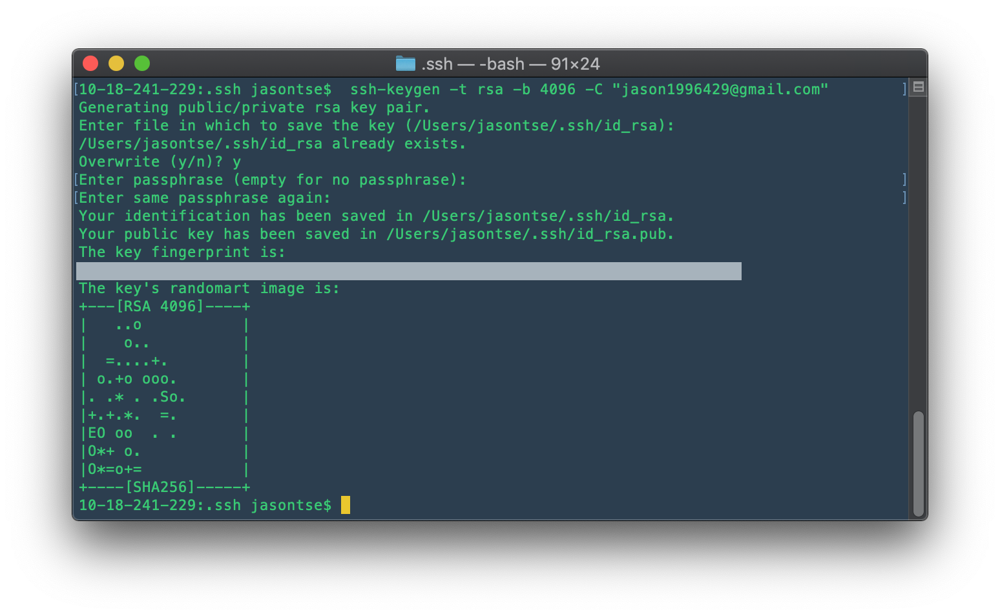
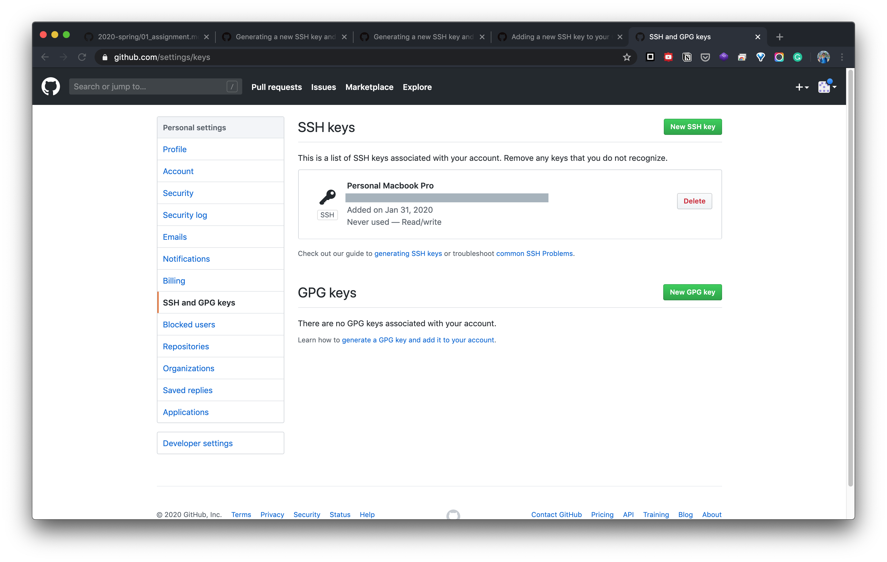
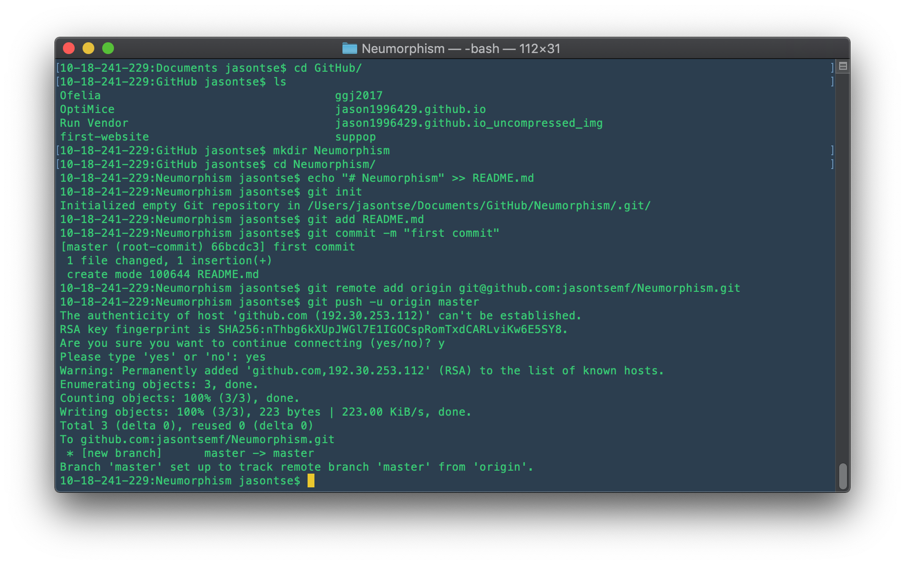
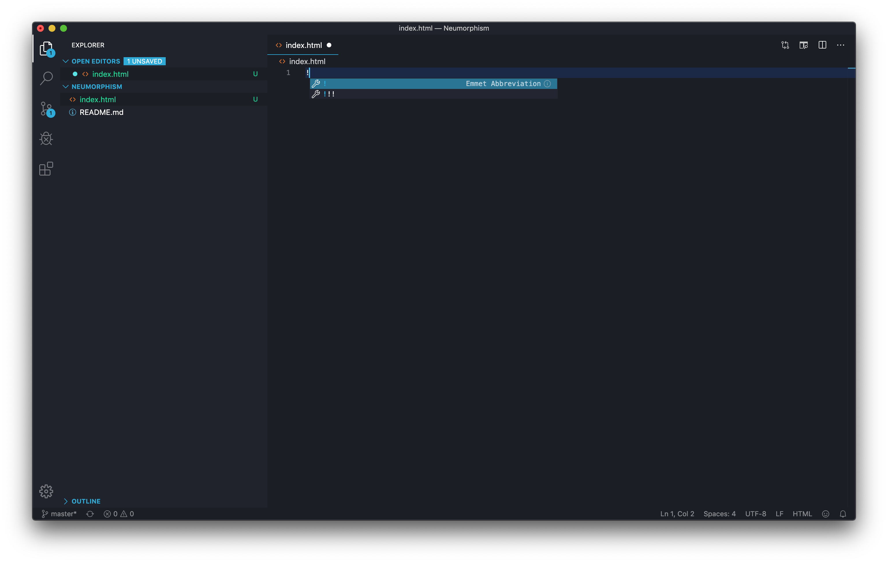
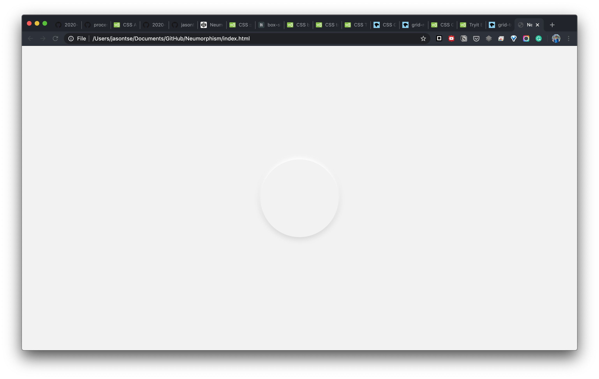
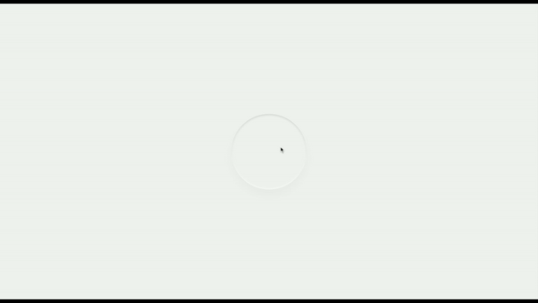
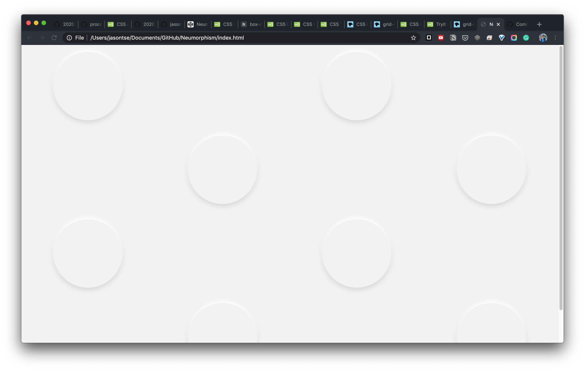
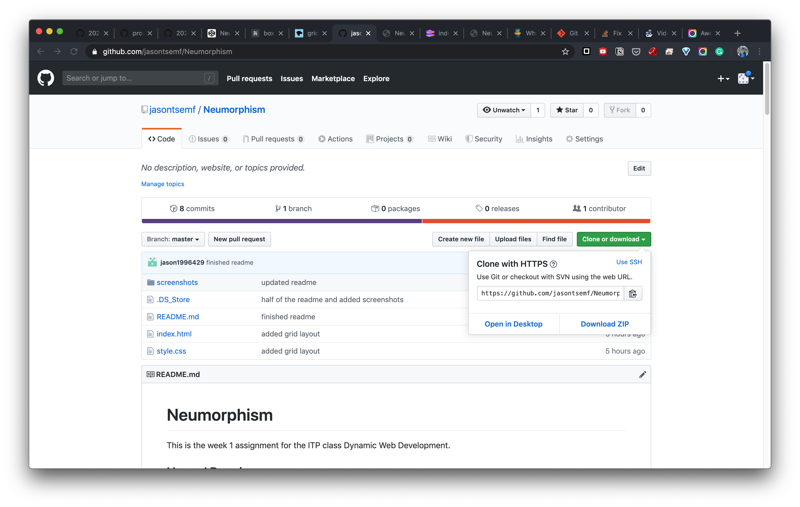
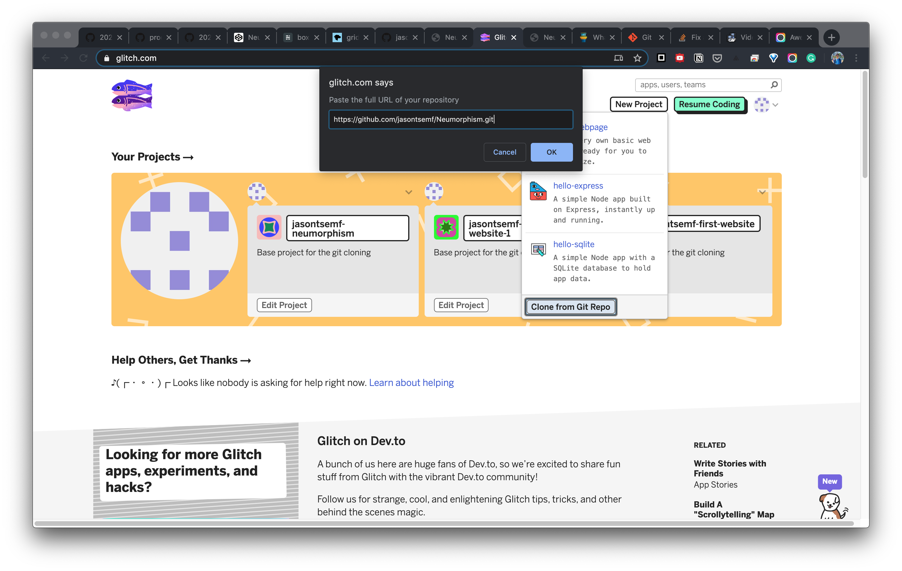
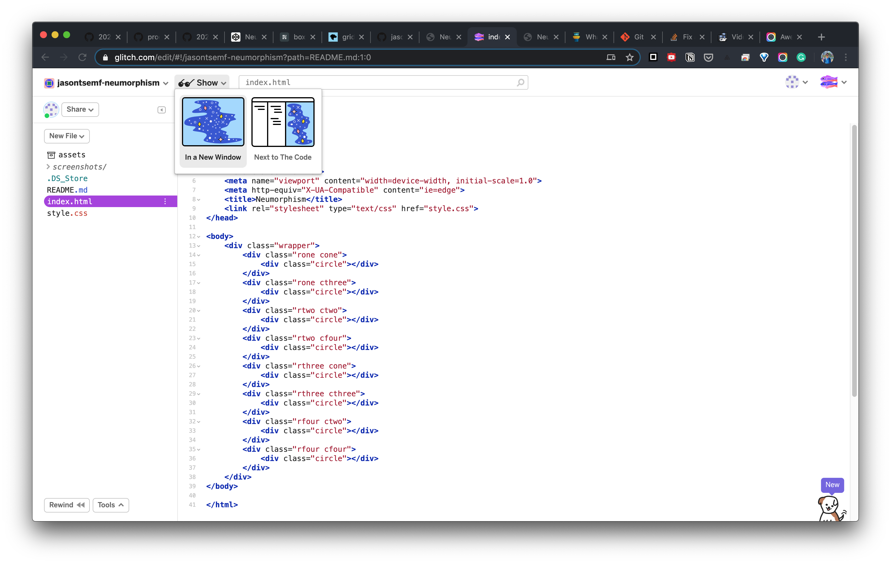

# Neumorphism

This is the week 1 assignment for the ITP class Dynamic Web Development.

## Up and Running

___

Following the tutorial, I generated the SSH Key and applied to Github.


Then started the project with a README file via terminal.


## Start HTML coding

I installed the `Install code command in PATH1` following [Visual Studio Code on macOS guide](https://code.visualstudio.com/docs/setup/mac), then launched visual studio from the terminal. Within VS Code's terminal, I `touch index.html` to start a blank index file. And also generated the boilerplate with the `!` keyword.



## The Project

___

### Inspiration


There are people saying Neumorphism aka Soft UI will become one of the UI trends in 2020, and I particularly appreciate the visual that defy the standard material design that has been popular for quite a while. Interestingly, I find the style to be reminiscent of how art pieces being exhibited in a gallery.


Therefore I wanted to try to make a mood piece, that resembles the aesthetic, instead of an actual usable UI. However, I can still make use of the techniques that I applied to my future UI/UX projects.

### Process


I stated to draw circles in a `<div>` with css. Primarily using `box-shadow` and `border-radius` css properties. The key to make a neumorphic element is to provide it a dark and soft shadow on one side, then another white shadow on the oppostie side.


The animated part of it is more complicated. The "inverted" circle is accomplisehd by using `box-shadow inset` instead of normal normal `box-shadow`, which is how inner shadow is made. Also a touch `z-index` move is added to simulate the pressed depth. The animation timing is done with a `cubic-bezier` curve but not simple `ease-in-out`. Then the animation is done in different handlers/stages. in the following order.

```

static --> ::after --> :hover --> hover::after

```


Then I layout them out with the vanilla css grid system, but not `Bootstrap`, which is the framework I am used to. What I was trying to accomplish is something different from just normal responsive grid, but an alternating grid, and it is being done with `grid-row` and `grid-col`. I assigned them with numbered row and coloumn class manually to achieve this layout.

### Struggles

I tried to use 2 `nth-child()` selector to handle circles in odd and even number programmatically to layout them alternatively. However I could had a hard time figuring out the Math for the columns and the actual CSS syntax that works with the CSS grid system. So I did not finish it with this approach.

### Reference

1. [CSS Transitions](https://www.w3schools.com/css/css3_transitions.asp)
2. [CSS transition-timing-function Property](https://www.w3schools.com/cssref/css3_pr_transition-timing-function.asp)
3. [CSS ::after Selector](https://www.w3schools.com/cssref/sel_after.asp)
4. [CSS Grid Layout](https://developer.mozilla.org/en-US/docs/Web/CSS/CSS_Grid_Layout)
5. [CSS Box Shadow](https://css-tricks.com/snippets/css/css-box-shadow/)
6. [CSS :nth-child() Selector](https://www.w3schools.com/cssref/sel_nth-child.asp)

## Deploy to Glitch

___


Copying the HTTPS .git URL on GitHub.

Login Glitch.com, create a new project by cloning from Git Repo, and paste the URL to finish.

View `index.html` in another window.
